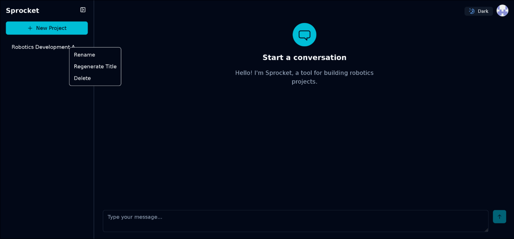
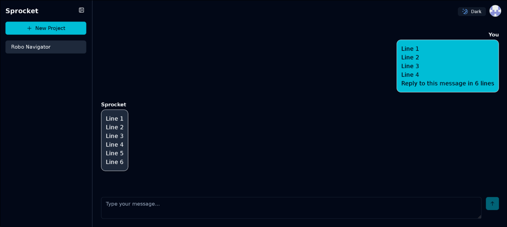
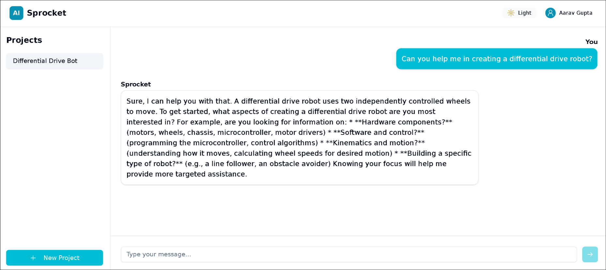
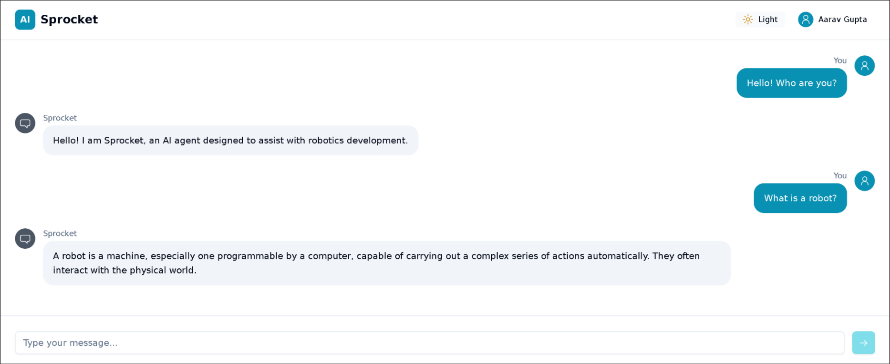
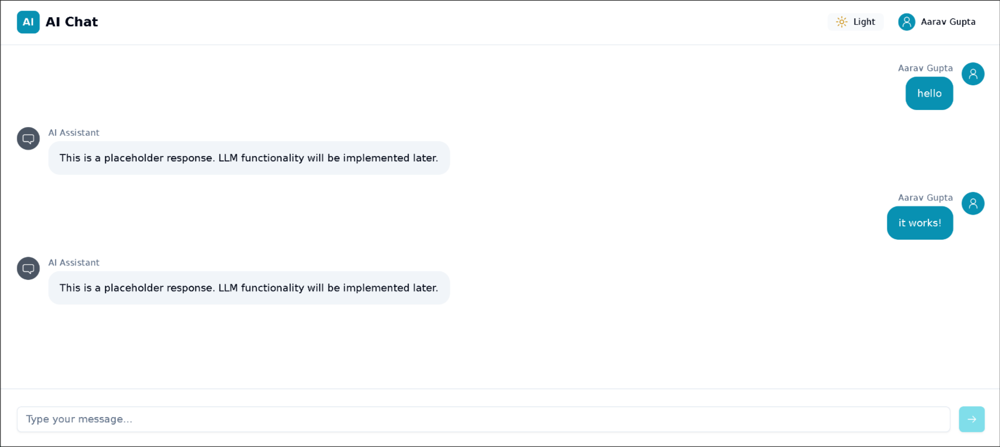
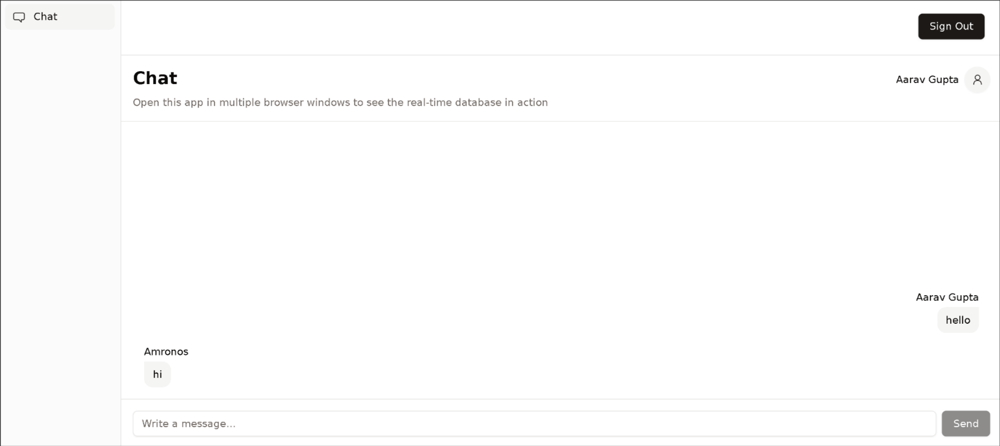

## 19th to 20th September 2025

I added rate limiting for both the amount of messages sent and tokens used to the app. 
Right now the app simply blocks you from sending any messages without giving an explanation in the UI, this will be improved in the future.

I also added more features to the sidebar. The full title of the thread can now be seen when hovering over the button and it can also be right-clicked to get options for renaming or regenerating the title and deleting the thread.

|  |  |

## 17th September 2025

I cleaned up the code a bit, aligned it with convex's best practices, made it more type-safe, etc.
During this I fully redid my code for the thread title generation and made it a lot simpler.
I also fixed a bug with the user ID being passed from the client (you can not trust it).

## 7th to 10th September 2025

I made many improvements to the UI alongside fixing various issues with it. 
I fixed the unauthenticated UI not working, added support for multi-line messages, allowed the sidebar to be opened and closed and made various improvements to the UI's looks.

## 5th to 6th September 2025

There is a sidebar now, through which you can switch between conversations/projects and create new ones. 
I also added automatic title generation for the conversations.

## 2nd to 4th September 2025

I implemented actual AI functionality into the app, the user can now chat with an AI like any other AI chat app. 
Convex's agent component was very useful in this. 
Complex responses currently look very bad, you can't have more than one conversation, and can't switch between AI models.
The next step is to implement all of these then proceed with the actual features of the app.

## 30th to 31st August 2025

I reworked the template these 2 days to create a temporary UI that feels more like an AI chatting app. 
Right now, there is just a default message sent as a response to the user's messages without any LLM functionality in it.

## 15th August 2025

I set up a [template from Convex](https://github.com/get-convex/templates/tree/main/template-nextjs-shadcn) today, the template came with a very basic chat app in which multiple users can talk to each other. 
I then added Auth to the app through WorkOS. 
The project will use Convex, React, Next.js, Tailwind, shadcn/ui, and WorkOS for now.

